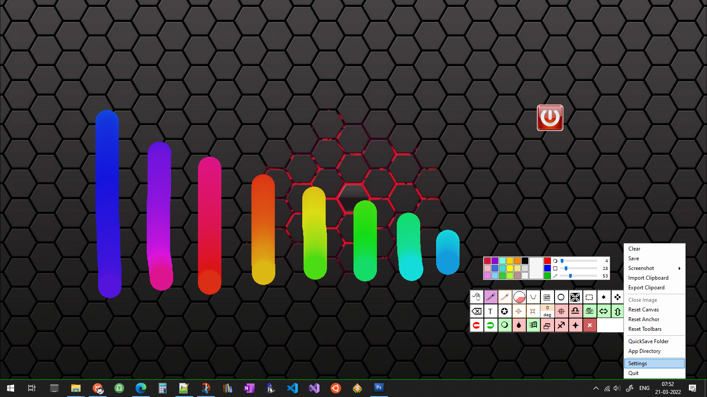
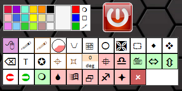
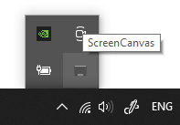

# ScreenCanvas

> Turn your desktop into a canvas!

## About

ScreenCanvas is a paint-like program that uses a transparent overlay (the 'canvas') on top working screen. 
This allows the background content to be visible all the time and allows you to write/draw on top of it. 
This 'transparent overlay' can be extended virtually to infinity and can be switched between multiple screens.



ScreenCanvas is supported for windows7 and above. Requires .NET framework 4.8 or above.


## Installation

ScreenCanvas is stand-alone, no installation required. You can compile from source code or use pre-compiled binaries available in zip format.

* [Download](https://github.com/Nelson-iitp/ScreenCanvas/raw/main/ScreenCanvas/ScreenCanvas.zip) and Extract zip

* Run `ScreenCanvas.exe` executable - this will show a green icon on the top left corner of working screen

* **Double click** on Icon to toggle canvas
	* green icon means desktop is accessible
	* red icon means ScreenCanvas Overlay is On - desktop not accessible
	*  
	
* When the Overlay is on, **right click** anywhere on the overlay(canvas) to see pallete and other options
	* 

* Right-click on Icon or use system-tray icon for more options
	* 
___


## Keyboard Controls


### General Controls

```
Escape        If canvas is ON then switch it OFF, otherwise quit app
F2            Shows recently handled files, `ctrl+C` clear recent list
F5            Refresh Canvas
F1            Toggle notification sounds
Enter         Toggle Canvas mode
Z/Y           Undo/Redo
D             Toggle Browser <-- use for file browsing & bookmarking
Decimal       Click through canvas (works on canvas mode only)|
```


### Canvas Controls

```
Arrow Keys        pan by screen width or height
	+Shift        pan by 100 pixels
	+Alt          pan to align the canvas to the edge of the screen
	+Control      resize canvas

Keys.Space              Show Overlay (fits the canvas in view - select view if canvas is very large)
	+ Alt               Reset Pan
	+ Shift             Clear Canvas
	+ Control + Alt     Reset Canvas size to default (set values on settings page)
	+ Control           Screenshot primary screen (quick screenshot)
	+ Control + Shift   Screenshot All screens (useful only when multiple display connected)

```

### Region Selection 

```
Keys.A             * itool.Selector for selecting rectangular regions on canvas
Control + Keys.A   * select full canvas
Shift + Keys.C     * itool.ScreenCopy for copying a rectangular region on screen (screen clip)   

Keys.Delete        * Deletes selected region
Control + Keys.X   * Cuts selected region
Control + Keys.C   * Copies selected region (only when the _selecting flag is on)          
Control + Keys.V   * Paste image from clipboard (maintain size, uses one point to paste)
Shift + Keys.V     * Paste image from clipboard (re-sizeable, uses 2 points to paste)
```


### Import/Export

```
Keys.C     Export whatever(image) is on the clipboard  to disk using a save file dialog

Keys.V     Import whatever is in the clipboard
           if there are files(images) in the clipboard (copied files) then import them (perform drag-drop)
           if there is an Image in the clipboard, paste it on canvas and resize canvas to image size
```


### Files I/O

To Open files, simply drag-drop

```
Control + Keys.W    Write changes on any files that were opened (drag-drop)
Keys.W              Close Image (set _opened flag to false)
Reset pan           > Hold Alt * to reset pan after closing
Clear canvas        > Hold Shift * to clear canvas after closing

Keys.S                  Save Canvas - Uses 3 flags
~ Solid Background      > Hold Shift    * save on solid color - the transparency key itself
~ On Selected Region    > Hold Control  * save the selection - instead of the whole canvas
~ Manual Save           > Hold Alt      * save manually at a selected location

Keys.Space
	+ Control			Screenshot primary screen (quick screenshot)
	+ Control + Shift	Screenshot All screens (useful only when multiple display connected)
```

### Editor Tools

```
Keys.P				itools.Pointer
Keys.M				itools.Marker
Keys.N				itools.Calligraphy
Keys.H				itools.Path
Keys.E				itools.Eraser	(+Shift to toggle eraser trails)
Keys.B				itools.Table
Keys.I				itools.Ellipse
Keys.K				itools.ColorPicker
Keys.T				itools.Text 
Shift + Keys.T        Toggle pasting text from clipboard
Control + Keys.T	  Shows the text-box widget (for entering text)
Keys.+/-              Changes the Width of the current itool . Markers, Shape or Eraser
```

### Axis & Grid

```
Keys.U              itools.AxisMarker for marking points on Axis & Grid 
Control + Keys.U    Clear axis points (that were marked)
Shift + Keys.U      Toggle axis visibility
Alt + Keys.U        Toggle perpendicular drop (from marked points)
```
